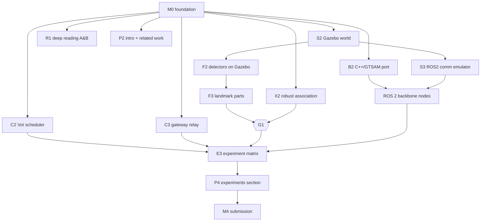

# Avatar SLAM: master plan

*Heterogeneous, decentralized, neural SLAM for air, ground, surface, and
underwater robot teams.*

| | |
|---|---|
| **PI / sole confirmed author** | Luiz Eugenio Santos Araujo Filho, ITA (repository owner) |
| **Started** | 2026-09-28 |
| **Plan version** | v2.6 (update the version and the changelog at the bottom whenever you change scope) |
| **Goal** | A journal paper accepted at **IEEE RA-L or T-RO** (PI decision D1), with open code and an open benchmark |
| **Reference fleet** | Husky UGV · Tarot 680 UAV · BlueROV2 UUVs · surface gateway ([`hardware.md`](hardware.md), ADR-0006) |

> **Why "Avatar"?** The Avatar masters every element. Avatar SLAM makes robots
> in the air, on earth, and in the water build one map.

---

## 0. TL;DR

1. **Gap.** Decentralized C-SLAM exists within one medium: air/ground on RF,
   or underwater on acoustic links. The only cross-medium C-SLAM, *Above and
   Below* (RA-L 2026), is centralized, uses only a USV and AUVs, and did not
   use real acoustic links. Nobody builds one consistent map from a
   **decentralized air + ground + surface + underwater** team. See
   [`research/gap_analysis.md`](research/gap_analysis.md).
2. **Two physical facts drive the design.** (i) Media split *perception*:
   cameras and LiDAR see the above-water part of a pier pile, and sonar sees
   the below-water part. (ii) Media split *communication*: RF runs at Mbps,
   acoustic at 10²–10⁴ bps with seconds of latency, and links come and go.
3. **Approach.** Each agent keeps its own lightweight object-level graph (the
   backbone). Waterline-crossing structures become **coaxial landmark parts**
   that tie above-water and below-water maps together. A **medium-aware
   scheduler** decides which map content goes over which link, by information
   value per byte. A **neural layer** (per-agent Gaussian submaps with camera,
   LiDAR, and sonar rasterizers) sits on the backbone and is exchanged
   opportunistically over RF.
4. **Evidence.** First a fast Python simulator (`avatar_py`, v0 done), then
   ROS 2 Jazzy + Gazebo Harmonic worlds (DAVE for underwater, PX4 for aerial;
   **Tier 2 v0 exists with kinematic rigs and a ray-cast sonar proxy**, ADR-0007),
   comparison with Kimera-Multi, Swarm-SLAM, SlideSLAM, DRACo-SLAM2, and an
   *Above and Below*-style centralized baseline, then real-data validation.
5. **Venue (decided: RA-L or T-RO).** Paper A (backbone +
   medium-aware communication + cross-medium association) goes to **RA-L**,
   with an IROS 2027 option (target submission ≈ 2027-03-01). Paper B (full
   system + neural layer + field data) goes to **T-RO**, ≈ 2027-Q4.
6. **Fleet (decided).** Husky (VLP-16 + D435i), Tarot 680 hexacopter (D435i + VLP-16,
   Pixhawk Cube, Jetson Nano), and BlueROV2 (DVL A50 + Micron Gemini 720s). A quay-side **surface gateway**
   relays between the Wi-Fi mesh and the acoustic modems (Water Linked M64,
   64 bps). The BlueROV2 tether never carries SLAM traffic. See
   [`hardware.md`](hardware.md).

---

## 1. Research questions and hypotheses

| RQ | Question | Hypothesis (falsifiable) | Primary metric |
|---|---|---|---|
| RQ1 | Can a decentralized team whose members perceive **disjoint media** build one globally consistent map without a server or prior calibration? | **H1.** Coaxial landmark parts (above ↔ below parts of piles, hulls, buoys) give enough inter-agent constraints to align all local maps. They reduce AUV ATE versus single-agent SLAM **when solo drift is small (≲ 1 m, decision D8)** (reference value: 30 %) and bring the team ATE close to a centralized oracle (reference: 1.5×). Reference values are ideals for comparison, not pass/fail thresholds (D11). | Team ATE, per-agent ATE, frame-alignment error |
| RQ2 | How should map content be shared when link bandwidths differ by ≥ 10³× and connectivity is intermittent? | **H2** (reworded after LOG L47, PI 2026-10-07). At equal bytes, ordering map digests by how likely they are to be matched merges the team more often than FIFO when few records get through (low rate, heavy loss); a value-of-information order adds nothing over a simple quality order. | ATE vs. bytes curves (per link type) |
| RQ3 | Does a decentralized, modality-aware neural layer improve the map beyond the object level without breaking consistency? | **H3.** Per-agent Gaussian submaps anchored to backbone keyframes and fused through backbone frames give better geometry (Chamfer, depth L1) than any single-agent map, at a bounded RF cost. | Chamfer / PSNR / depth-L1 vs. bytes |

## 2. Contributions (draft; bound to the novelty ledger)

| # | Contribution | Paper | Ledger |
|---|---|---|---|
| C1 | **Avatar SLAM backbone**: decentralized object-level C-SLAM for teams spanning air, ground, surface, and underwater. Per-agent 4-DoF factor graphs on a shared waterline datum, and condensed landmark sharing that avoids double counting. | A, B | N1 |
| C2 | **Cross-medium association**: coaxial landmark-part model, modality-aware candidate gating, and robust 4-DoF registration, including direct UAV↔AUV constraints through waterline-crossing structures. | A, B | N3 |
| C3 | **Medium-aware communication**: link models (RF / acoustic / surfacing windows), USV as gateway, a value-of-information-per-byte scheduler, and a compact wire format (16 B per landmark). | A, B | N2 |
| C4 | **Neural layer**: per-agent Gaussian submaps with camera, LiDAR, and imaging-sonar rasterizers, fused through the backbone and exchanged over RF under a budget. | B | N4 |
| C5 | **Open benchmark**: fast simulator + ROS 2/Gazebo multi-domain scenarios, ground truth, and communication traces; all code open (MIT). | A, B | N5 |

## 3. System architecture (summary)

Details: [`architecture.md`](architecture.md). Frames and units:
[`conventions.md`](conventions.md). Wire protocol:
[`spec/wire_format_v0.md`](spec/wire_format_v0.md).

```mermaid
flowchart LR
  subgraph Agent_i["Agent i (UAV / UGV / USV / AUV)"]
    S[Sensors<br/>camera / LiDAR / sonar / DVL / IMU / depth] --> FE[L1 Front-end<br/>odometry + object detection<br/>open-vocab (optical) / geometric (sonar)]
    FE --> LG[L2 Local graph<br/>4-DoF poses + landmark parts]
    LG --> DG[Digest builder<br/>condensed landmarks]
    DG --> CM[L3 Comm manager<br/>medium-aware scheduler]
    RX[Received digests] --> AS[Cross-medium association<br/>+ robust 4-DoF alignment]
    AS --> FG[L4 Fused graph<br/>local + inter-agent factors]
    LG --> FG
    FG --> NL[L5 Neural layer<br/>Gaussian submaps]
  end
  CM <-- RF (Mbps) --> Air[(Air/ground/surface peers)]
  CM <-- Acoustic (kbps) --> Water[(Underwater peers)]
  Air --> RX
  Water --> RX
```

**Invariant.** Digests are built only from an agent's *own* measurements (its
local graph), never from received information. Information therefore cannot
be double counted, and no consistency bookkeeping is needed (DDF-SAM-style;
see ADR-0004).

## 4. Work packages

Each WP lists its goal, deliverables, and acceptance criteria. Atomic tasks
with IDs, dependencies, and owners live in [`TASKS.md`](TASKS.md). WPs
separated by `‖` can run **in parallel** by different agents.

### WP-I: Infrastructure ‖ everything
- **Goal:** a reproducible dev environment and CI that stays green.
- **Deliverables:** repo skeleton, CI (Python, C++, ROS 2 colcon, LaTeX), Docker
  images (`ros:jazzy` + Gazebo Harmonic + DAVE), pre-commit hooks.
- **Host (T-I1-06, D12): resolved 2026-09-30.** The project moved to `luiz-predator-neo`
  (i9-14900HX, 32 threads; RTX 4070 8 GB; about 300 GB free; Docker with the GPU). Compute
  differs from the old host, so timings are re-measured. Tier-2 recording and the DAVE sonar
  run in the images `avatar-tier2` and `avatar-dave` (`docker/`, `experiments/gazebo/README.md`).
  The reference Python environment is `avatar_py/requirements-lock.txt`: results depend on the
  NumPy version (LOG L33).
- **Accept:** a fresh clone passes all AGENTS.md §6 commands in CI.

### WP-R: Research and novelty ‖ everything
- **Goal:** keep the novelty claims true and the related work complete.
- **Deliverables:** a deep reading of *Above and Below* and DRACo-SLAM2 (method,
  data, limitations), a monthly re-search, and every bib entry verified.
- **Accept:** every ledger row is `confirmed` or dropped before submission.

### WP-S: Simulation
- **S1 (done v0).** Fast Python multi-domain simulator: harbour world, 4 domains,
  LiDAR, camera, imaging-sonar, and odometry models, and a comm network.
- **S2 (v0 done as ADR-0007 rigs; DAVE/PX4/Clearpath open, T-S2-05).** Gazebo Harmonic multi-domain world with the reference fleet: Husky
  (`clearpath_simulator`, VLP-16 + D435i), PX4 SITL hexacopter (D435i + VLP-16, D6), BlueROV2
  (DAVE, Gemini-configured multibeam, DVL), a static surface gateway, and an
  optional BlueBoat. A single `unified.launch.py` spawns all of them.
- **S3.** ROS 2 comm emulator: a gateway node that enforces the `avatar.comm`
  channel models on `EncodedPacket` topics, using the same parameters as S1.
- **S4.** Scenario suite: Harbour, Dam face, Offshore jacket, and Aliasing grid.
  Each has ground-truth export (poses, landmark parts) and comm traces.
- **Accept:** S2 streams sensor data from all four domains at ≥ 0.5× real time on
  the lab workstation. S1 and S2 share scenario YAML files.

### WP-F: Front-ends (per agent)
- **F1.** Odometry adapters: VIO/LIO for air and ground, DVL-INS for the AUV, and a
  depth sensor. Output 4-DoF increments with covariance.
- **F2.** Object detection: open-vocabulary 2D (a YOLO-World / Grounded-SAM class
  detector with CLIP-family embeddings) on camera; Euclidean clustering on
  LiDAR; blob/segment extraction on imaging sonar (DRACo2-style). *Geometric
  clustering on LiDAR, depth and the sonar proxy: v0 in `avatar.tier2` (T-F2-02/03);
  the image detector is open (T-F2-01).*
- **F3.** Local object tracking into **landmark parts** (medium-tagged), and
  intra-agent coaxial linking (the USV sees both parts). *A tracker in the
  dead-reckoning frame exists but fails when drift approaches the landmark
  spacing (LOG L28); association against the agent's SLAM estimate is T-F3-02.*
- **F4.** Modality-invariant geometric descriptors (footprint, vertical profile)
  plus compressed semantic descriptors (PQ / int8 of CLIP embeddings).
- **Accept:** object F1 ≥ 0.8 on Gazebo scenes, and descriptor size ≤ 32 B per landmark.

### WP-X: Cross-medium association
- **X1 (done v0.1).** Candidate gating (medium, class, extent, descriptor),
  σ-scaled gates, a pairwise-consistency graph with greedy cliques (PCM-style),
  MSAC scoring, an ambiguity test, and weighted 4-DoF refinement.
  Cross-medium pairs use horizontal-only residuals. Result: 99.6 % pair
  precision over 20 seeds (docs/LOG.md L4).
- **X2.** Robustness: PCM/GNC over inter-agent factors, and object-graph matching
  (ROMAN / DRACo2-style) for aliasing-prone grids.
- **X3.** Direct UAV↔AUV constraints through spanning structures, relayed by
  the USV gateway.
- **Accept:** frame error < 0.5 m / 2° in Harbour, and zero accepted wrong
  alignments across 50 seeds of the Aliasing scenario.

### WP-B: Back-end
- **B1 (done v0).** Python 4-DoF factor graph + Levenberg–Marquardt, robust
  kernels, marginal covariances, the DDF-style condensed-landmark fused graph.
- **B2.** C++ port on **GTSAM** (iSAM2 incremental) in `avatar_core`, matched
  against B1 on shared vectors.
- **B3.** Study of distributed-solver options: condensed sharing (current)
  versus distributed PGO (DPGO/DGS) over RF clusters. This yields a hybrid design.
- **B4.** Acoustic range factors (modem ranging / USBL) with latency-aware
  timestamps.
- **B5.** 6-DoF extension (only if a front-end cannot supply gravity-aligned data).
- **Accept:** B2 matches B1 to within 1 mm / 0.01° on test graphs. Onboard
  update < 50 ms at 1000 keyframes.

### WP-C: Communication
- **C1 (done v0).** RF/acoustic channel models, TDMA share, loss vs. range,
  latency, and a wire format v0 with CRC (Python + C++ golden vectors).
- **C2.** VoI-per-byte scheduler: the expected reduction in the receiver's
  uncertainty (or alignment observability) per landmark, divided by encoded size.
- **C3.** USV gateway: store-and-forward relay between the RF and acoustic media,
  with deduplication.
- **C4.** Surfacing windows: an AUV bursts over RF when `z > -0.5 m`.
- **Accept:** a bandwidth sweep of 100 bps–10 kbps (acoustic) tests H2. Done (T-C5-01, LOG L47): H2 reworded; the quality order stays the default.

### WP-N: Neural layer (Paper B, gate G2)
- **N1.** Per-agent 3DGS submaps anchored to backbone keyframes (camera, then
  LiDAR depth).
- **N2.** Imaging-sonar rasterizer (range–azimuth; SonarSplat-style) for AUV and USV submaps.
- **N3.** Decentralized submap exchange over RF (pruned Gaussians, delta
  updates), and uncertainty-weighted merging.
- **N4.** Open-vocabulary feature field (CLIP distillation) for language queries.
- **Accept:** H3 holds on ≥ 2 scenarios.

### WP-E: Evaluation and experiments
- **E1 (done v0).** ATE (4-DoF Umeyama), team ATE, frame error, comm accounting.
- **E2.** Baselines. Adapters for Swarm-SLAM (ROS 2), Kimera-Multi, SlideSLAM,
  DRACo-SLAM2, ROMAN (association only), the centralized oracle, and an
  *A&B-style* centralized server.
- **E3.** Experiment matrix scripts that write `paper/data/*.csv` (AGENTS.md §5).
- **E4.** Real-data validation. Candidates: DRACo2 and A&B data (ask the
  authors), the ARACATI sonar datasets, and the PI's own sonar/AUV data.
- **Accept:** every paper number is regenerated by `make -C experiments paper-data`.

### WP-V: Visualization
- **V1 (done v0).** `viz/scenario_viewer.html` (three.js): world, waterline, landmark
  parts, ground truth vs. estimated trajectories, comm events.
- **V2.** Live ROS 2 web viewer (foxglove_bridge / rosbridge + three.js).
- **V3.** Figure pipeline (matplotlib → PDF, consistent palette).

### WP-P: Paper
- **P1 (done).** LaTeX skeleton (`paper/`), IEEEtran journal, section stubs.
- **P2.** Intro + related work (from the ledgers). **P3.** Method. **P4.** Experiments.
- **P5.** Figures (a system teaser, a coaxial-part diagram, bandwidth curves).
- **P6.** Internal adversarial review: an agent plays Reviewer 2 against the checklist in `paper/README.md`.
- **Accept:** submission-ready PDF, a clean `UNVERIFIED` check, and a supplementary video.

## 5. Milestones and gates

| ID | Target date | Content | Exit criterion |
|---|---|---|---|
| **M0** | 2026-10-05 | Foundation: rules, plan, v0 sim + backbone + codec, CI | CI green; `avatar.cli compare` runs |
| **M1** | 2026-10-31 | Backbone v1 in the fast sim: robust association (X2), VoI scheduler (C2), gateway (C3); first ablations. Gazebo world spawns all 4 domains (S2) | H1/H2 trends visible in the fast sim |
| **G1** | 2026-11-30 | **Go/No-Go:** cross-medium association works on Gazebo (DAVE) sonar data | Frame error < 1 m on the Gazebo Harbour. If not, re-scope C2 to USV-bridged association only. **Preliminary (2026-09-30, LOG L28-L33, pinned environment):** passes on Tier 2 with ground-truth intra-agent tracks (kinematic rigs, sonar proxy): 40 of 40 seeds (development 0-19, held-out 20-39). With a realistic front-end (an EKF-SLAM tracker over the agent's own estimate, with joint pairing): 18/20 development and 18/20 held-out seeds (the dead-reckoning NN tracker: 8/20 and 11/20); with a UAV LiDAR, 30/30. A 20-seed count moves by about two runs with the NumPy version, and two of the failures are a wrong few-inlier alignment (T-F3-05). **Repeated on DAVE's sonar images (T-S2-05, development seeds, LOG L34-L35): with ground-truth intra-agent ids G1 holds in 18/20 runs (proxy 20/20), after fixing two pipeline defects (T-F2-06); with the EKF tracker in 6/20 (T-F3-06). Not yet met with a realistic front-end; held-out seeds not recorded with the sonar** **All 80 seeds, paper data with the veto rule and 200 clique seeds (LOG L39-L43): with ground-truth tracks 78/80 on the proxy, 78/80 with the UAV LiDAR and 69/80 on sonar images; with the EKF tracker 74/80, 78/80 and 45/80. Fresh seeds are not harder than seeds 0-39. On sonar images G1 is met with ground-truth tracks, not yet with a realistic tracker: the remaining failures are a BlueROV2 with sparse fixes (T-F3-06, D14)** |
| **M2** | 2026-12-20 | ROS 2 end-to-end (front-ends → backbone → comm emulator); baselines on air/ground and underwater subsets | Full experiment matrix runs unattended |
| **M3** | 2027-02-10 | Paper A: experiments + real-data validation + draft | Internal review passed |
| **M4** | ≈ 2027-03-01 | **Paper A submission** (RA-L + IROS 2027 option; verify the deadline) + arXiv | Submitted |
| **G2** | 2027-04-15 | **Go/No-Go neural layer:** H3 on ≥ 1 scenario | If not, Paper B focuses on field validation + scale |
| **M5** | 2027-09-30 | Paper B: neural layer + field experiments | Draft |
| **M6** | ≈ 2027-11 | **Paper B submission (T-RO)** | Submitted |

If the PI chooses a single T-RO paper (D1-a), M4 becomes an internal milestone
and M6 moves to ≈ 2027-06, with the neural layer scoped down.

## 6. Experimental protocol (both papers)

- **Scenarios:** Harbour (pier piles, moored hulls, buoys, quay), Dam face
  (the PI's inspection background), Offshore jacket (large spanning legs),
  Aliasing grid (a regular pile field: stress test).
- **Teams:** reference fleet {Husky + Tarot + 2 BlueROV2 + gateway} (main
  result); {BlueBoat + 2 BlueROV2} (the *A&B* setting: direct comparison, needs the
  optional USV); {Tarot + Husky} (the air/ground baselines' home turf).
- **Communication conditions:** M64 (64 bps, primary), SeaTrac X150 class
  (~100 bps), generic 1 kbps, and a sweep. Real modem vs. "emulated acoustic" is
  always labelled.
- **Conditions:** independent · centralized oracle (ground-truth association,
  unlimited comm) · A&B-style centralized server (estimated association,
  every byte counted) · baselines on their supported subsets · **Avatar SLAM**.
- **Ablations:** −coaxial parts · −VoI (FIFO) · −gateway · −descriptors ·
  acoustic bandwidth sweep 100 bps → 10 kbps · packet-loss sweep · number of AUVs 1 → 4.
- **Metrics:** ATE/RPE per agent and team (4-DoF alignment); inter-agent frame
  error; landmark map precision/recall at 0.5 m and position RMSE; bytes per link
  type; time to first alignment; CPU per agent; neural: PSNR, depth-L1, Chamfer.
- **Statistics:** ≥ 10 seeds per configuration; mean ± 95 % CI (bootstrap);
  paired Wilcoxon signed-rank against the strongest baseline; report failures.

## 7. Risk register

| ID | Risk | L | I | Mitigation | Owner WP |
|---|---|---|---|---|---|
| R1 | *Above and Below*'s authors extend to decentralized / air agents first | M | H | Move fast (Paper A by 2027-03). Put the weight on C3 (medium-aware comm) + the UAV↔AUV link. Post an arXiv preprint at submission | R |
| R2 | Simulated sonar too idealized for cross-medium association | H | H | Use DAVE's physics-based multibeam; validate on real sonar data (E4); report the sim-to-real gap honestly. **Now concrete:** Tier 2 v0 uses a ray-cast proxy (no speckle, multipath, shadows; ADR-0007), so G1 on Tier 2 is necessary, not sufficient. **Tested (LOG L34-L35):** on DAVE's sonar images, with ground-truth intra-agent ids, G1 holds in 18/20 development runs (proxy 20/20); with the EKF tracker in 6/20. The gap is now the realistic tracker (T-F3-06), not the sonar data | S, X |
| R3 | No real multi-domain field experiment | M | M | Reference fleet exists (ADR-0006). Still needed: modems, UGPS, RTK and a site (T-H1-*). Fall back to real single-medium datasets; label sim vs. real | E |
| R8 | 64 bps acoustic too slow to connect the team within one BlueROV2 battery | M | H | Token buckets + descriptor stripping (done), VoI scheduler (T-C2-01), SeaTrac X150 upgrade path, longer exchange periods under water | C |
| R9 | UUV heading drift near steel piles (compass) | H | M | Model it in sim (yaw bias); cross-medium constraints; report it as a motivating result | X |
| R10 | D435i-only UAV contributes few landmarks (≤ 6 m depth) | H | L | **Decided (D6, 2026-10-06): a VLP-16 on the Tarot**; the simulated LiDAR fleet is the evidence (LOG L31). Residual: payload and endurance (T-H1-05) | S |
| R13 | The Tarot's companion computer is a Jetson Nano: its last JetPack (4.6, Ubuntu 18.04) predates ROS 2 Jazzy, and 4 GB / 4 Cortex-A57 cores must run the VLP-16 and D435i drivers, odometry, the front-end and the agent (verify on the device) | M | M | ROS 2 Jazzy in a container on the Nano, or offload LIO to the Cube + a lighter odometry; measure the budget in T-H1-05 before field work; an Orin-class module is the fallback | H |
| R4 | Perceptual aliasing in regular pile grids yields wrong alignments | M | H | PCM/GNC + object-graph matching (X2); the Aliasing scenario as a gate | X |
| R11 | **Intra-agent** association fails when the pose uncertainty approaches the spacing of similar landmarks (Tier 2: BlueROV2 drift 8-10 m vs. 8 m between pier rows), and the damage is mostly duplicate landmarks (lost loop closures), which no robust kernel repairs (Tier 1 confirms it, LOG L32) | M | H | Joint-covariance EKF tracker with joint pairing (T-F3-02/03, done: fresh-seed G1 6/10 → 9/10); the UAV's sparse-fix aliasing (T-F3-04) is the residual; structured errors in Tier 1 (T-S1-09, done: LOG L32) | F, X |
| R12 | Tier-2 results rest on proxies (kinematic rigs, ray-cast sonar) until DAVE's sonar images, and PX4 and Clearpath if they are added, are recorded; the host now has Docker and a GPU (T-I1-06 done) | H | M | DAVE sonar recording and front-end (T-S2-05, ADR-0008); PX4 and Clearpath deferred; label Tier-2 results as kinematic rigs and sonar proxy everywhere until then | I, S |
| R5 | Neural layer scope creep delays Paper A | H | M | Neural layer is Paper B only; gate G2 | N |
| R6 | Multi-agent development drifts (contracts break) | M | M | ADRs, golden vectors, CI on every PR, TASKS.md ownership | I |
| R7 | GPU compute limits (Gazebo GPU sonar + 3DGS) | M | M | Fast sim for CI and sweeps; Gazebo on the lab GPU; Docker images | I |

## 8. Parallelization map (how many agents can work at once)



Right after M0, up to **7 agents** can work in parallel without touching the
same files: S2, X2, C2, C3, B2, R1, P2.

## 9. Decisions requested from the PI

| ID | Decision | Options | Status |
|---|---|---|---|
| D1 | Venue | RA-L or T-RO | **Decided (PI, 2026-09-28):** aim for RA-L or T-RO. Plan: Paper A → RA-L (+IROS'27 option), Paper B → T-RO |
| D2 | Hardware | – | **Decided (PI):** Husky + VLP-16 + D435i; Tarot 680 + D435i + Cube; BlueROV2 + DVL A50 + Micron Gemini 720s. Comm stack delegated to Claude and decided in ADR-0006. **Updated (PI, 2026-10-06):** the Tarot 680 hexacopter carries a Jetson Nano companion computer, a Pixhawk Cube (hex) and a D435i; a VLP-16 is added (D6) |
| D3 | Authors | – | **Decided (PI, 2026-10-06):** Luiz Eugenio Santos Araujo Filho (ITA), for now the only author. Contacting *A&B* / DRACo authors for data remains open |
| D4 | Compute | GPU workstation for Gazebo + 3DGS | **Resolved with D12:** `luiz-predator-neo` (RTX 4070 8 GB, Docker with the GPU) |
| D5 | Scenario priority | Harbour first vs. Dam first | Harbour (it matches A&B for comparison) |
| D6 | Purchases for field work | M64 modems, UGPS G2, mesh radios, RTK; optional BlueBoat and a UAV LiDAR | Open. **Evidence (LOG L31): the UAV LiDAR removes the tracker's recurrent failure in simulation (G1 30/30, Tarot alone 0.10 m), so it is the first item to buy.**  See [`hardware.md`](hardware.md) §6. **UAV LiDAR decided (PI, 2026-10-06): a VLP-16 on the Tarot.** Modems, UGPS, mesh radios and RTK remain open |
| D7 | Affiliation / funding line for the paper | – | **Affiliation decided (PI, 2026-10-06): ITA.** Funding line open |
| D8 | Scope of H1 (drift correction) | All drift vs. small drift | **Decided (PI, 2026-09-28):** claim correction only for small drift (solo AUV drift ≲ 1 m over the mission); metre-level correction is later work (T-X1-03). LOG L20–L23 |
| D9 | AUV heading model | Compass-aided (bias-free) vs. gyro-integrated (bias) | **Decided (PI, 2026-09-28):** if heading is mostly magnetometer-based, ignore the bias; if the magnetometer is unreliable (steel in harbours), model it. See LOG L24 |
| D10 | Robust estimation | Huber vs. certifiable / GNC methods | **PI guidance (2026-09-28):** adopt Carlone-group robust estimation (graduated non-convexity) where it helps; decide the default from data (LOG L25) |
| D11 | Hypothesis targets | Pass/fail thresholds vs. reference values | **Decided (PI, 2026-09-28):** numeric targets in H1–H3 are ideal reference values for comparison; the paper reports measured gains and their trend, step by step |
| D12 | Host resources for the Docker route (DAVE, PX4, Clearpath) | ≥ 40 GB free on `/` (now 21 GB) or Docker `data-root` on another disk; user in group `docker` (or rootless `podman`) | **Resolved 2026-09-30 (PI).** The project moved to `luiz-predator-neo`: about 300 GB free, user in group `docker`, GPU in containers. T-I1-03 and T-S2-05 are unblocked |
| D13 | What the paper reports: seed sets (0-39 or 0-79), estimator defaults (the veto rule of T-F3-05), reference fleet (camera-only or LiDAR UAV) | – | **Decided (PI, 2026-10-06), after the analysis of T-E3-02 (LOG L39):** Tier 2 is reported over every clean recording, seeds 0-79 (development 0-19, held out 20-79), for the proxy, the UAV-LiDAR fleet and DAVE's sonar; the veto rule (threshold 8) is the default. Implemented in T-E3-03. The reference fleet (camera-only or LiDAR UAV in the main tables) stays open: T-S4-05 |
| D14 | BlueROV2 with sparse sonar fixes (LOG L41-L43): the EKF tracker splits piles when one BlueROV2 sees too few per frame; software (a keyframe window, L42) did not help | A wider-aperture or second imaging sonar on that vehicle, now concretely a Blue Robotics **Ping360** 360° scanning sonar (added to the fleet as an option by the PI, 2026-10-07; `hardware.md` §2, design implication 4); a survey path that keeps more piles in view; or accept and report the limit | **Decided (PI, 2026-10-07): a Ping360 on each BlueROV2** (bought). Evidence (LOG L45): with an idealized ray-cast Ping360 the EKF tracker on sonar images reaches G1 56/60 held-out against 34/60 without. Next: T-S1-12 renders it with DAVE; the paper's sonar results move to the Ping360 fleet once T-S1-12 confirms them |
| D15 | Estimate the odometry's translation (DVL) and gyro scale errors by default (`model_odometry_scale`, T-X1-04) | Keep them unmodelled (today: a model-mismatch stress), or estimate them as the heading bias (D9), with priors from the platform spec | **Decided (PI, 2026-10-07): estimate them by default** (`model_odometry_scale = True`); all paper data regenerated (LOG L48); the estimator without them stays as a model-mismatch ablation in the drift paragraph (`drift_anchored_noscale.csv`). Evidence (LOG L46): team ATE −34 % decentralized / −22 % oracle on `fleet_transit_anchored`, −10 % / −8 % on `fleet_default` |

## 10. Joint project with `heterogeneous_slam` and goals (2026-10-06)

`~/heterogeneous_slam` (local only, no remote) is the first scoping of the same paper, written on
2026-09-28: UAV + UGV + AUV, 3D Gaussian Splatting submaps, UDON-style consensus, DINOv2/CLIP
semantics, sonar-LiDAR-camera registration. Its factual claims are corrected in
[`research/gap_analysis.md`](research/gap_analysis.md) §2, and its workspace never built. It is now
an **archive that donates parts** to this repository; nothing is developed there. A part enters
only through the task named below, adapted to this repository's contracts (the naming of
[`conventions.md`](conventions.md) §7 replaces its `robot_<domain>_<id>` schema).

| Part (paths under `~/heterogeneous_slam/`) | Enters through | How |
|---|---|---|
| `ros2_ws/src/heterogeneous_bringup/launch/{unified,air,ground,underwater}.launch.py` | T-S2-02 | Skeleton of `unified.launch.py`: a PX4 hexacopter instead of `gz_x500`, the `clearpath_simulator` Husky, a DAVE (`d2121a5`) BlueROV2 instead of uuv_simulator |
| `docker/docker-compose.yml` (discovery server, headless Gazebo service) | T-I1-03 | Compose file over the existing `avatar-tier2` and `avatar-dave` images |
| `ros2_ws/src/heterogeneous_bringup/params/{ekf_auv,ekf_ugv,slam_toolbox_ugv}.yaml` | T-F1-01 | Starting values for the odometry adapters (`robot_localization`) |
| `ros2_ws/src/heterogeneous_bringup/worlds/{harbor_inspection,offshore_platform}.sdf` | T-S4-02 | Geometry reference for the dam-face and offshore scenarios (the PI's 2022 dam inspection); worlds are generated from Python scenarios here, and these files point to missing assets |
| `ros2_ws/src/heterogeneous_slam_core/src/cross_modal_registration/sonar_lidar_icp.cpp` | T-E2-07 | Starting point of a scan-level registration comparator |
| `heterogeneous_msgs/msg/{Submap,ConsensusState,SemanticEntity}.msg`, `srv/QuerySemanticMap.srv`, `camera_sonar_association.cpp`, `PROJECT_PLAN.md` §3 (phases 3-4), §6-§7 | T-N1-01 … T-N4-01 (Paper B, gate G2) | Design input for the neural layer; new messages need an ADR (ADR-0005) |
| `ros2_ws/src/heterogeneous_benchmarks/config/baseline_configs.yaml` | T-E2-01 … T-E2-04 | Baseline list; GRAND-SLAM, MAGiC-SLAM and MNE-SLAM are neural baselines for Paper B |
| Everything else (headers without code, `run_benchmarks.py`, its CI and Dockerfiles, `uuv_simulator_ros2/`, its topic and TF schema) | – | Not used: superseded here |

**Main goal.** Publish Avatar SLAM, a decentralized SLAM system that builds one map from aerial,
ground and underwater robots by linking structures that cross the waterline, over links down to
64 bit/s: Paper A to RA-L (≈ 2027-03-01) and Paper B, with the neural layer and field data, to
T-RO (≈ 2027-11), with open code and an open benchmark.

| # | Specific goal | Measure | Due | Tasks |
|---|---|---|---|---|
| G-1 | No work on one disk only | Every task branch on GitHub, CI green on the open PR, the sonar recordings (`results/tier2/*/sonar.npz`, 2.9 GB, not bit-reproducible) copied off the host | 2026-10-07 | T-I1-07 |
| G-2 | Held-out results understood | The cause of the fresh-seed G1 gap named; a recommendation for D13 | 2026-10-20 | T-E3-02 |
| G-3 | Realistic sonar front-end | DAVE sonar with the EKF tracker: G1 ≥ 16/20 development seeds, then one held-out evaluation | 2026-10-31 (M1) | T-F3-06 |
| G-4 | H2 settled | Bandwidth and loss sweep (100 bit/s to 10 kbit/s) in `paper/data`; H2 kept, reworded or dropped. **Settled (PI, 2026-10-07): H2 reworded** (RQ2 row; LOG L47) | 2026-10-31 (M1) | T-C2-01, T-C5-01 |
| G-5 | ROS 2 end to end in Gazebo | `unified.launch.py` runs the reference fleet (DAVE sonar) with agent nodes and the comm emulator; the same G1 as the offline Tier-2 pipeline on the same seeds | 2026-12-20 (M2) | T-S2-02, T-S3-01, T-I1-09 |
| G-6 | Fair baselines | ≥ 2 external baselines (Swarm-SLAM on air/ground, DRACo-SLAM2 underwater) and the *A&B*-style server, on the same inputs | 2027-01-31 | T-E2-01 … T-E2-04 |
| G-7 | Real data | ≥ 1 real sonar sequence through the front-end | 2027-02-10 (M3) | T-R1-05, T-E4-01 |
| G-8 | Paper A submitted | No UNVERIFIED cited entry; Reviewer-2 checklist ticked | ≈ 2027-03-01 (M4) | T-R1-04, T-P* |
| G-9 | Neural layer go/no-go | Per-agent 3DGS submaps beat single-agent geometry (Chamfer) on ≥ 1 scenario | 2027-04-15 (G2) | T-N1-01 … |

## 11. Changelog

- **v2.6 (2026-10-07).** PI decisions: D14 (a Ping360 on each BlueROV2; T-S1-12 to P0), D15 (odometry scale errors estimated by default; all paper data regenerated, LOG L48), H2 reworded (G-4 settled). Merged tasks moved from review to done.
- **v2.5 (2026-10-07).** T-C5-01 (LOG L47): bandwidth to 10 kbit/s and packet-loss sweep in `paper/data` and the paper; a pre-registered test: VoI beats FIFO under heavy loss but not the quality order; H2 rewording proposed (G-4).
- **v2.4 (2026-10-07).** T-X1-04 (LOG L46): strict "never hurt" is unattainable (the oracle is worse than solo on one seed); the harm comes from unmodelled odometry scale errors; new decision D15 (estimate them by default); the no-avoidable-harm criterion moves to T-X1-03.
- **v2.3 (2026-10-07).** Ping360 in simulation (T-S1-11, LOG L45): evidence for D14 (sonar-EKF G1 held-out 34 -> 56/60, idealized sensor); new task T-S1-12 (DAVE-rendered Ping360). Bibliography verified (T-R1-04, L44).
- **v2.2 (2026-10-07).** T-F3-06: 200 clique seeds by default (LOG L41, L43: sonar-EKF G1 held-out 30 -> 34/60, wrong alignments 123 -> 53); T-F3-07 negative (L42, reverted); paper data regenerated. New decision D14 (BlueROV2 with sparse sonar fixes).
- **v2.1 (2026-10-06).** T-E3-02 done (LOG L39: 22 late recordings, recorder fixed, fresh seeds not harder). PI decisions: D13 (Tier 2 over seeds 0-79, veto rule by default; T-E3-03) and ADR-0009 accepted (`rclpy` wrappers for simulation nodes, AGENTS.md §2 amended).
- **v2.0 (2026-10-06).** Joint project: `heterogeneous_slam` becomes an archive that donates parts (§10), with the main and specific goals. PI decisions: authors and affiliation (D3, D7: Luiz Eugenio Santos Araujo Filho, ITA), the Tarot carries a Jetson Nano, a Pixhawk Cube and a D435i, plus a VLP-16 (D2, D6); paper content is decided after the analysis (D13). New risk R13 (Jetson Nano), new tasks T-E3-02 (fresh seeds fail G1 more often, LOG L38), T-I1-07, T-I1-09 (ADR-0009, proposed), T-E2-07, T-S4-05, T-H1-05. All task branches pushed to GitHub.

- **v1.9 (2026-10-01).** T-F2-06 (LOG L35): L34's failure on sonar images was two pipeline defects (footprint ranking in the association; stale sonar frames); with ground-truth ids G1 is 18/20 on sonar images. Wire format v0: a footprint of 0 x 0 means "not measured" (bytes and golden vectors unchanged). New task T-F3-06 (EKF tracker on sonar).
- **v1.8 (2026-09-30).** DAVE's sonar in Tier 2 (LOG L34, ADR-0008): the recording pass, the sonar-image detector, and the first repetition of G1 on its images: not met on the development seeds (2/20 teams merge with ground-truth ids). R2 raised to H likelihood; new task T-F2-06; the re-scope clause of G1 is left to the PI.
- **v1.7 (2026-09-30).** Host moved to `luiz-predator-neo`: D12 and T-I1-06 resolved, T-I1-03 and T-S2-05 in progress. ADR-0008 (proposed): Tier 2 records in Docker and adds DAVE's multibeam sonar. Paper data regenerated in a pinned environment (LOG L33): Tier 1 unchanged, EKF G1 18/20 on both seed sets, a few-inlier alignment failure (new task T-F3-05) and a realism study on 20 seeds (T-S1-10). DAVE's sonar runs headless and deterministically (LOG L34).
- **v1.6 (2026-09-30).** Host blocker made explicit: more disk space and Docker access
  (T-I1-06, D12) before the DAVE / PX4 / Clearpath work (T-I1-03, T-S2-05) can start.
  T-S1-09 and T-I1-05 done (LOG L32, fixture); R11 text corrected.
- **v1.5 (2026-09-30).** T-F3-04: the UAV's residual aliasing is a sensor problem; a
  LiDAR on the Tarot gives G1 30/30 (LOG L31). D6 now has evidence. Held-out seeds
  are 20-39.
- **v1.4 (2026-09-30).** T-F3-03: joint pairing of ambiguous detections; fresh-seed
  G1 9/10 (LOG L30). Development seeds are now 0-19, held-out 20-29. New task T-F3-04
  (UAV aliasing).
- **v1.3 (2026-09-30).** T-F3-02: a joint-covariance EKF-SLAM tracker replaces the
  dead-reckoning-frame association in Tier 2 (development seeds G1 10/10, fresh seeds
  8/10; LOG L29). R11 downgraded from H to M likelihood. New task T-F3-03. The 20
  recorded seeds are split into development (0-9) and held-out (10-19) sets.
- **v1.2 (2026-09-29).** Tier 2 v0 recorded in the plan (ADR-0007: kinematic rigs,
  ray-cast sonar proxy). Preliminary G1 result and its limits (LOG L28). New risks
  R11 (intra-agent association in the dead-reckoning frame) and R12 (no DAVE/PX4
  host). New tasks T-F3-02, T-S1-09, T-S2-05, T-I1-05.
- **v1.1 (2026-09-28).** PI decisions D1–D3 recorded. Reference fleet and comm
  stack added (ADR-0006, `hardware.md`). The USV becomes optional and the
  surface gateway relays. New risks R8–R10. New decisions D6–D7.
- **v1.0 (2026-09-28).** Initial plan. Gap re-scoped after the literature check
  (*Above and Below* found; Kimera-Multi corrected to distributed; DAVE ROS 2
  replaces the uuv_simulator port). v0 code for S1, X1, B1, C1, E1, V1, and P1
  delivered.
