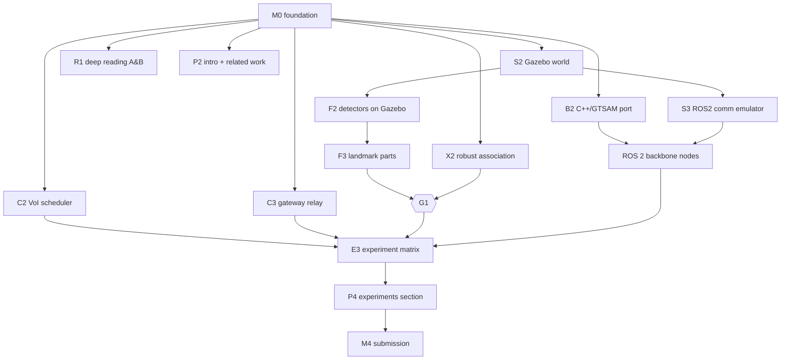

# Avatar SLAM: master plan

*Heterogeneous, decentralized, neural SLAM for air, ground, surface, and
underwater robot teams.*

| | |
|---|---|
| **PI** | Luiz Eugênio Filho (repository owner) |
| **Started** | 2026-09-28 |
| **Plan version** | v1.0 (update the version and the changelog at the bottom whenever you change scope) |
| **Goal** | A journal paper accepted at IEEE T-RO / RA-L (or IJRR / T-FR), with open code and an open benchmark |

> **Why "Avatar"?** The Avatar masters every element. Avatar SLAM makes robots
> in the air, on earth, and in the water build one map.

---

## 0. TL;DR

1. **Gap.** Decentralized C-SLAM exists within one medium: air/ground on RF,
   or underwater on acoustic links. The only cross-medium C-SLAM, *Above and
   Below* (RA-L 2026), is centralized, uses only a USV and AUVs, and did not
   use real acoustic links. Nobody builds one consistent map from a
   **decentralized air + ground + surface + underwater** team. See
   [`research/gap_analysis.md`](research/gap_analysis.md).
2. **Two physical facts drive the design.** (i) Media split *perception*:
   cameras and LiDAR see the above-water part of a pier pile, and sonar sees
   the below-water part. (ii) Media split *communication*: RF runs at Mbps,
   acoustic at 10²–10⁴ bps with seconds of latency, and links come and go.
3. **Approach.** Each agent keeps its own lightweight object-level graph (the
   backbone). Waterline-crossing structures become **coaxial landmark parts**
   that tie above-water and below-water maps together. A **medium-aware
   scheduler** decides which map content goes over which link, by information
   value per byte. A **neural layer** (per-agent Gaussian submaps with camera,
   LiDAR, and sonar rasterizers) sits on the backbone and is exchanged
   opportunistically over RF.
4. **Evidence.** First a fast Python simulator (`avatar_py`, v0 done), then
   ROS 2 Jazzy + Gazebo Harmonic worlds (DAVE for underwater, PX4 for aerial),
   comparison with Kimera-Multi, Swarm-SLAM, SlideSLAM, DRACo-SLAM2, and an
   *Above and Below*-style centralized baseline, then real-data validation.
5. **Recommended venue strategy (decision D1).** Paper A (backbone +
   medium-aware communication + cross-medium association) goes to **RA-L**,
   with an IROS 2027 option (target submission ≈ 2027-03-01). Paper B (full
   system + neural layer + field data) goes to **T-RO**, ≈ 2027-Q4.

---

## 1. Research questions and hypotheses

| RQ | Question | Hypothesis (falsifiable) | Primary metric |
|---|---|---|---|
| RQ1 | Can a decentralized team whose members perceive **disjoint media** build one globally consistent map without a server or prior calibration? | **H1.** Coaxial landmark parts (above ↔ below parts of piles, hulls, buoys) give enough inter-agent constraints to align all local maps. They reduce AUV ATE by ≥ 30 % versus single-agent SLAM, and bring the team ATE within 1.5× of a centralized oracle. | Team ATE, per-agent ATE, frame-alignment error |
| RQ2 | How should map content be shared when link bandwidths differ by ≥ 10³× and connectivity is intermittent? | **H2.** A value-of-information-per-byte scheduler reaches ≥ 90 % of the full-communication accuracy while sending ≤ 20 % of the bytes of FIFO/greedy sharing. On acoustic links it beats FIFO at equal bytes. | ATE vs. bytes curves (per link type) |
| RQ3 | Does a decentralized, modality-aware neural layer improve the map beyond the object level without breaking consistency? | **H3.** Per-agent Gaussian submaps anchored to backbone keyframes and fused through backbone frames give better geometry (Chamfer, depth L1) than any single-agent map, at a bounded RF cost. | Chamfer / PSNR / depth-L1 vs. bytes |

## 2. Contributions (draft; bound to the novelty ledger)

| # | Contribution | Paper | Ledger |
|---|---|---|---|
| C1 | **Avatar SLAM backbone**: decentralized object-level C-SLAM for teams spanning air, ground, surface, and underwater. Per-agent 4-DoF factor graphs on a shared waterline datum, and condensed landmark sharing that avoids double counting. | A, B | N1 |
| C2 | **Cross-medium association**: coaxial landmark-part model, modality-aware candidate gating, and robust 4-DoF registration, including direct UAV↔AUV constraints through waterline-crossing structures. | A, B | N3 |
| C3 | **Medium-aware communication**: link models (RF / acoustic / surfacing windows), USV as gateway, a value-of-information-per-byte scheduler, and a compact wire format (16 B per landmark). | A, B | N2 |
| C4 | **Neural layer**: per-agent Gaussian submaps with camera, LiDAR, and imaging-sonar rasterizers, fused through the backbone and exchanged over RF under a budget. | B | N4 |
| C5 | **Open benchmark**: fast simulator + ROS 2/Gazebo multi-domain scenarios, ground truth, and communication traces; all code open (MIT). | A, B | N5 |

## 3. System architecture (summary)

Details: [`architecture.md`](architecture.md). Frames and units:
[`conventions.md`](conventions.md). Wire protocol:
[`spec/wire_format_v0.md`](spec/wire_format_v0.md).

```mermaid
flowchart LR
  subgraph Agent_i["Agent i (UAV / UGV / USV / AUV)"]
    S[Sensors<br/>camera / LiDAR / sonar / DVL / IMU / depth] --> FE[L1 Front-end<br/>odometry + object detection<br/>open-vocab (optical) / geometric (sonar)]
    FE --> LG[L2 Local graph<br/>4-DoF poses + landmark parts]
    LG --> DG[Digest builder<br/>condensed landmarks]
    DG --> CM[L3 Comm manager<br/>medium-aware scheduler]
    RX[Received digests] --> AS[Cross-medium association<br/>+ robust 4-DoF alignment]
    AS --> FG[L4 Fused graph<br/>local + inter-agent factors]
    LG --> FG
    FG --> NL[L5 Neural layer<br/>Gaussian submaps]
  end
  CM <-- RF (Mbps) --> Air[(Air/ground/surface peers)]
  CM <-- Acoustic (kbps) --> Water[(Underwater peers)]
  Air --> RX
  Water --> RX
```

**Invariant.** Digests are built only from an agent's *own* measurements (its
local graph), never from received information. Information therefore cannot
be double counted, and no consistency bookkeeping is needed (DDF-SAM-style;
see ADR-0004).

## 4. Work packages

Each WP lists its goal, deliverables, and acceptance criteria. Atomic tasks
with IDs, dependencies, and owners live in [`TASKS.md`](TASKS.md). WPs
separated by `‖` can run **in parallel** by different agents.

### WP-I: Infrastructure ‖ everything
- **Goal:** a reproducible dev environment and CI that stays green.
- **Deliverables:** repo skeleton, CI (Python, C++, ROS 2 colcon, LaTeX), Docker
  images (`ros:jazzy` + Gazebo Harmonic + DAVE), pre-commit hooks.
- **Accept:** a fresh clone passes all AGENTS.md §6 commands in CI.

### WP-R: Research and novelty ‖ everything
- **Goal:** keep the novelty claims true and the related work complete.
- **Deliverables:** a deep reading of *Above and Below* and DRACo-SLAM2 (method,
  data, limitations), a monthly re-search, and every bib entry verified.
- **Accept:** every ledger row is `confirmed` or dropped before submission.

### WP-S: Simulation
- **S1 (done v0).** Fast Python multi-domain simulator: harbour world, 4 domains,
  LiDAR, camera, imaging-sonar, and odometry models, and a comm network.
- **S2.** Gazebo Harmonic multi-domain world: DAVE (underwater; ROS 2 Jazzy branch),
  PX4 SITL x500 (aerial), a Clearpath/TurtleBot-class UGV, and a USV (DAVE/VRX-style
  model or LOTUSim). A single `unified.launch.py` spawns all of them.
- **S3.** ROS 2 comm emulator: a gateway node that enforces the `avatar.comm`
  channel models on `EncodedPacket` topics, using the same parameters as S1.
- **S4.** Scenario suite: Harbour, Dam face, Offshore jacket, and Aliasing grid.
  Each has ground-truth export (poses, landmark parts) and comm traces.
- **Accept:** S2 streams sensor data from all four domains at ≥ 0.5× real time on
  the lab workstation. S1 and S2 share scenario YAML files.

### WP-F: Front-ends (per agent)
- **F1.** Odometry adapters: VIO/LIO for air and ground, DVL-INS for the AUV, and a
  depth sensor. Output 4-DoF increments with covariance.
- **F2.** Object detection: open-vocabulary 2D (a YOLO-World / Grounded-SAM class
  detector with CLIP-family embeddings) on camera; Euclidean clustering on
  LiDAR; blob/segment extraction on imaging sonar (DRACo2-style).
- **F3.** Local object tracking into **landmark parts** (medium-tagged), and
  intra-agent coaxial linking (the USV sees both parts).
- **F4.** Modality-invariant geometric descriptors (footprint, vertical profile)
  plus compressed semantic descriptors (PQ / int8 of CLIP embeddings).
- **Accept:** object F1 ≥ 0.8 on Gazebo scenes, and descriptor size ≤ 32 B per landmark.

### WP-X: Cross-medium association
- **X1 (done v0.1).** Candidate gating (medium, class, extent, descriptor),
  σ-scaled gates, a pairwise-consistency graph with greedy cliques (PCM-style),
  MSAC scoring, an ambiguity test, and weighted 4-DoF refinement.
  Cross-medium pairs use horizontal-only residuals. Result: 99.6 % pair
  precision over 20 seeds (docs/LOG.md L4).
- **X2.** Robustness: PCM/GNC over inter-agent factors, and object-graph matching
  (ROMAN / DRACo2-style) for aliasing-prone grids.
- **X3.** Direct UAV↔AUV constraints through spanning structures, relayed by
  the USV gateway.
- **Accept:** frame error < 0.5 m / 2° in Harbour, and zero accepted wrong
  alignments across 50 seeds of the Aliasing scenario.

### WP-B: Back-end
- **B1 (done v0).** Python 4-DoF factor graph + Levenberg–Marquardt, robust
  kernels, marginal covariances, the DDF-style condensed-landmark fused graph.
- **B2.** C++ port on **GTSAM** (iSAM2 incremental) in `avatar_core`, matched
  against B1 on shared vectors.
- **B3.** Study of distributed-solver options: condensed sharing (current)
  versus distributed PGO (DPGO/DGS) over RF clusters. This yields a hybrid design.
- **B4.** Acoustic range factors (modem ranging / USBL) with latency-aware
  timestamps.
- **B5.** 6-DoF extension (only if a front-end cannot supply gravity-aligned data).
- **Accept:** B2 matches B1 to within 1 mm / 0.01° on test graphs. Onboard
  update < 50 ms at 1000 keyframes.

### WP-C: Communication
- **C1 (done v0).** RF/acoustic channel models, TDMA share, loss vs. range,
  latency, and a wire format v0 with CRC (Python + C++ golden vectors).
- **C2.** VoI-per-byte scheduler: the expected reduction in the receiver's
  uncertainty (or alignment observability) per landmark, divided by encoded size.
- **C3.** USV gateway: store-and-forward relay between the RF and acoustic media,
  with deduplication.
- **C4.** Surfacing windows: an AUV bursts over RF when `z > -0.5 m`.
- **Accept:** a bandwidth sweep of 100 bps–10 kbps (acoustic) shows H2.

### WP-N: Neural layer (Paper B, gate G2)
- **N1.** Per-agent 3DGS submaps anchored to backbone keyframes (camera, then
  LiDAR depth).
- **N2.** Imaging-sonar rasterizer (range–azimuth; SonarSplat-style) for AUV and USV submaps.
- **N3.** Decentralized submap exchange over RF (pruned Gaussians, delta
  updates), and uncertainty-weighted merging.
- **N4.** Open-vocabulary feature field (CLIP distillation) for language queries.
- **Accept:** H3 holds on ≥ 2 scenarios.

### WP-E: Evaluation and experiments
- **E1 (done v0).** ATE (4-DoF Umeyama), team ATE, frame error, comm accounting.
- **E2.** Baselines. Adapters for Swarm-SLAM (ROS 2), Kimera-Multi, SlideSLAM,
  DRACo-SLAM2, ROMAN (association only), the centralized oracle, and an
  *A&B-style* centralized server.
- **E3.** Experiment matrix scripts that write `paper/data/*.csv` (AGENTS.md §5).
- **E4.** Real-data validation. Candidates: DRACo2 and A&B data (ask the
  authors), the ARACATI sonar datasets, and the PI's own sonar/AUV data.
- **Accept:** every paper number is regenerated by `make -C experiments paper-data`.

### WP-V: Visualization
- **V1 (done v0).** `viz/scenario_viewer.html` (three.js): world, waterline, landmark
  parts, ground truth vs. estimated trajectories, comm events.
- **V2.** Live ROS 2 web viewer (foxglove_bridge / rosbridge + three.js).
- **V3.** Figure pipeline (matplotlib → PDF, consistent palette).

### WP-P: Paper
- **P1 (done).** LaTeX skeleton (`paper/`), IEEEtran journal, section stubs.
- **P2.** Intro + related work (from the ledgers). **P3.** Method. **P4.** Experiments.
- **P5.** Figures (a system teaser, a coaxial-part diagram, bandwidth curves).
- **P6.** Internal adversarial review: an agent plays Reviewer 2 against the checklist in `paper/README.md`.
- **Accept:** submission-ready PDF, a clean `UNVERIFIED` check, and a supplementary video.

## 5. Milestones and gates

| ID | Target date | Content | Exit criterion |
|---|---|---|---|
| **M0** | 2026-10-05 | Foundation: rules, plan, v0 sim + backbone + codec, CI | CI green; `avatar.cli compare` runs |
| **M1** | 2026-10-31 | Backbone v1 in the fast sim: robust association (X2), VoI scheduler (C2), gateway (C3); first ablations. Gazebo world spawns all 4 domains (S2) | H1/H2 trends visible in the fast sim |
| **G1** | 2026-11-30 | **Go/No-Go:** cross-medium association works on Gazebo (DAVE) sonar data | Frame error < 1 m on the Gazebo Harbour. If not, re-scope C2 to USV-bridged association only |
| **M2** | 2026-12-20 | ROS 2 end-to-end (front-ends → backbone → comm emulator); baselines on air/ground and underwater subsets | Full experiment matrix runs unattended |
| **M3** | 2027-02-10 | Paper A: experiments + real-data validation + draft | Internal review passed |
| **M4** | ≈ 2027-03-01 | **Paper A submission** (RA-L + IROS 2027 option; verify the deadline) + arXiv | Submitted |
| **G2** | 2027-04-15 | **Go/No-Go neural layer:** H3 on ≥ 1 scenario | If not, Paper B focuses on field validation + scale |
| **M5** | 2027-09-30 | Paper B: neural layer + field experiments | Draft |
| **M6** | ≈ 2027-11 | **Paper B submission (T-RO)** | Submitted |

If the PI chooses a single T-RO paper (D1-a), M4 becomes an internal milestone
and M6 moves to ≈ 2027-06, with the neural layer scoped down.

## 6. Experimental protocol (both papers)

- **Scenarios:** Harbour (pier piles, moored hulls, buoys, quay), Dam face
  (the PI's inspection background), Offshore jacket (large spanning legs),
  Aliasing grid (a regular pile field: stress test).
- **Teams:** {USV + 2 AUV} (the *A&B* setting: direct comparison), {UAV + UGV}
  (the air/ground baselines' home turf), {UAV + UGV + USV + 2 AUV} (full Avatar).
- **Conditions:** independent · centralized oracle (ground-truth association,
  unlimited comm) · A&B-style centralized server (estimated association,
  every byte counted) · baselines on their supported subsets · **Avatar SLAM**.
- **Ablations:** −coaxial parts · −VoI (FIFO) · −gateway · −descriptors ·
  acoustic bandwidth sweep 100 bps → 10 kbps · packet-loss sweep · number of AUVs 1 → 4.
- **Metrics:** ATE/RPE per agent and team (4-DoF alignment); inter-agent frame
  error; landmark map precision/recall at 0.5 m and position RMSE; bytes per link
  type; time to first alignment; CPU per agent; neural: PSNR, depth-L1, Chamfer.
- **Statistics:** ≥ 10 seeds per configuration; mean ± 95 % CI (bootstrap);
  paired Wilcoxon signed-rank against the strongest baseline; report failures.

## 7. Risk register

| ID | Risk | L | I | Mitigation | Owner WP |
|---|---|---|---|---|---|
| R1 | *Above and Below*'s authors extend to decentralized / air agents first | M | H | Move fast (Paper A by 2027-03). Put the weight on C3 (medium-aware comm) + the UAV↔AUV link. Post an arXiv preprint at submission | R |
| R2 | Simulated sonar too idealized for cross-medium association | M | H | Use DAVE's physics-based multibeam; validate on real sonar data (E4); report the sim-to-real gap honestly | S, X |
| R3 | No real multi-domain hardware experiment | H | M | Real single-medium datasets + a partial field test (USV + ROV + UAV) with the PI's lab; say explicitly which results are sim | E |
| R4 | Perceptual aliasing in regular pile grids yields wrong alignments | M | H | PCM/GNC + object-graph matching (X2); the Aliasing scenario as a gate | X |
| R5 | Neural layer scope creep delays Paper A | H | M | Neural layer is Paper B only; gate G2 | N |
| R6 | Multi-agent development drifts (contracts break) | M | M | ADRs, golden vectors, CI on every PR, TASKS.md ownership | I |
| R7 | GPU compute limits (Gazebo GPU sonar + 3DGS) | M | M | Fast sim for CI and sweeps; Gazebo on the lab GPU; Docker images | I |

## 8. Parallelization map (how many agents can work at once)



Right after M0, up to **7 agents** can work in parallel without touching the
same files: S2, X2, C2, C3, B2, R1, P2.

## 9. Decisions requested from the PI

| ID | Decision | Options | Recommendation |
|---|---|---|---|
| D1 | Venue strategy | (a) one T-RO paper; (b) Paper A to RA-L (+IROS'27), then Paper B to T-RO | **(b)**: it plants the flag early against R1 |
| D2 | Hardware available (ITA/partners) | e.g. BlueROV2, quadrotor, UGV, USV, sonar model | Needed for E4 and R3 |
| D3 | Authors and collaborators | Contact the *A&B* / DRACo authors for data? | Contact them for the dataset after G1 |
| D4 | Compute | GPU workstation for Gazebo + 3DGS | Needed by M1 |
| D5 | Scenario priority | Harbour first vs. Dam first | Harbour (it matches A&B for comparison) |

## 10. Changelog

- **v1.0 (2026-09-28).** Initial plan. Gap re-scoped after the literature check
  (*Above and Below* found; Kimera-Multi corrected to distributed; DAVE ROS 2
  replaces the uuv_simulator port). v0 code for S1, X1, B1, C1, E1, V1, and P1
  delivered.
