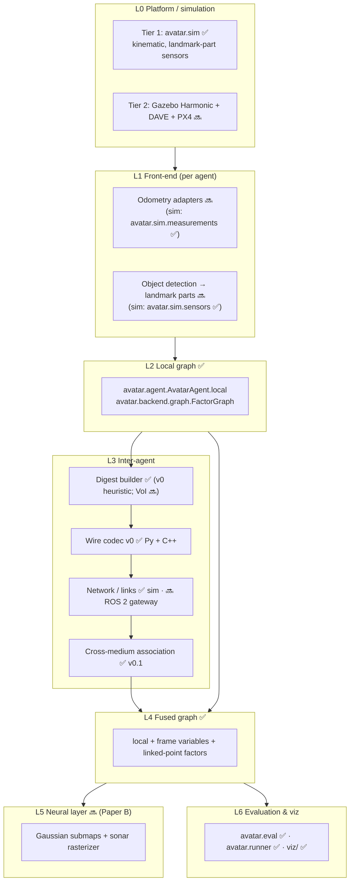
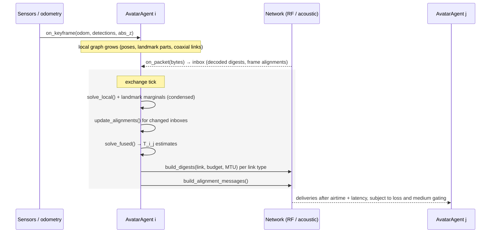

# Architecture

Status: **v0 (2026-09-28)**. The Python reference and C++ core exist. ROS 2 nodes and
Gazebo worlds are planned (see `TASKS.md`). This document describes both what
exists (✅) and what is planned (🔜), so parallel work fits together.

## 1. Layers

## 2. Module map

| Layer | Python reference (`avatar_py/avatar/`) | C++ (`avatar_core/`) | ROS 2 (`ros2/`) |
|---|---|---|---|
| Types / enums | `types.py` ✅ | `include/avatar/types.hpp` ✅ | `avatar_msgs` constants ✅ |
| Frames, 4-DoF algebra | `geometry.py` ✅ | `frames.hpp/.cpp` ✅ | TF conventions (`conventions.md` §7) |
| Semantics | `semantics.py` ✅ | – | – |
| World / agents / sensors | `sim/world.py`, `sim/agents.py`, `sim/sensors.py`, `sim/measurements.py`, `sim/scenarios.py` ✅ | – | Gazebo worlds 🔜 |
| Channel + network | `comm/channel.py` (incl. Wi-Fi mesh, M64, X150 profiles), `comm/network.py` ✅ | – | comm emulator node 🔜 |
| Surface gateway relay | `comm/gateway.py` ✅ (ADR-0006) | – | gateway node 🔜 |
| Wire codec | `comm/codec.py` ✅ | `comm/codec.hpp/.cpp` ✅ | `EncodedPacket.msg` ✅ |
| Factor graph | `backend/graph.py` ✅ | GTSAM port 🔜 (T-B2-01) | – |
| Association | `frontend/association.py` ✅ | port 🔜 | – |
| Agent runtime | `agent.py` ✅ | – | `avatar_ros` node 🔜 |
| Evaluation / runner / CLI | `eval/metrics.py`, `runner.py`, `cli.py` ✅ | – | – |
| Visualization | `cli.py export-viz` ✅ | – | live web viewer 🔜 |

## 3. Runtime of one agent (decentralized mode)

Each agent processes keyframes at 1 Hz (Tier 1). Every `exchange_period_s`
(default 20 s) it runs an **exchange tick**:

**Invariant (ADR-0004):** digests are built from `local` only.

**Budgets (ADR-0006):** each (node, link) has a token bucket. Unspent bytes carry
over to the next tick (cap: max(4 ticks, 1 MTU)), frame-alignment packets count
against it, and acoustic digests omit descriptors.

**Gateways:** nodes with `role="gateway"` run no SLAM. At each tick they forward
acoustic packets to RF unchanged and re-encode RF records for acoustic, keeping the
originator's `sender_id`.

**Team frame:** the anchor agent (`usv_0` in `harbor`, `ugv_0` in `harbor_fleet`) composes its own and received
`FRAME_ALIGNMENT` estimates (`eval.metrics.chain_frames`, best-first by σ).

## 4. Estimator details (v0)

- State: 4-DoF poses `("x", k)`, landmark parts `("l", lid)`, frames `("T", j)`.
- Factors: see the `backend/graph.py` docstring. Robust Huber (k = 2 whitened) on
  `linked_point` and `range`.
- Solver: Levenberg–Marquardt on sparse normal equations (SciPy SuperLU), IRLS
  for robust weights. Marginals come from an LU factorization of `JᵀJ` (Laplace).
- Priors: first pose `[0, 0, z0, 0]` (σ = 1 mm / 1 mrad, σz = 0.1 m); frame
  variables get a `z ≈ 0` prior (σ = 0.1 m) and weak priors on the other axes.
- Cross-medium linked points use only the x/y rows. Their σ includes a coaxial
  model term (0.15 m) and quantization noise (Δ²/12).

## 5. Tier-1 simulator defaults

| Domain | Odometry σ per √m (xy / z / yaw) | Yaw-bias std [rad/m] | Absolute z | Sensors | Links |
|---|---|---|---|---|---|
| UAV | 0.04 / 0.02 / 0.003 | 5e-4 | baro (σ 0.3 m) | `lidar_aerial` 50 m, `camera` 30 m | RF |
| UGV | 0.03 / 0.01 / 0.002 | 5e-4 | start z known (σ 0.1 m) | `lidar` 40 m, `camera` 30 m | RF |
| USV | 0.04 / 0.005 / 0.003 | 1e-3 | surface (σ 0.05 m) | `lidar`, `camera`, `sonar` 20 m | RF + acoustic |
| AUV | 0.02 / 0.005 / 0.002 | 1.5e-3 | depth (σ 0.05 m) | `sonar` 20 m, `camera_underwater` 4 m | acoustic |

| Link | Rate | Latency | Range | Loss near → far | MTU | Share |
|---|---|---|---|---|---|---|
| RF | 2 Mbps | 5 ms | 300 m | 1 % → 30 % | 1400 B | 10 % utilization |
| Acoustic | 1000 bps | 0.2 s + d/1500 | 1500 m | 5 % → 40 % | 256 B | TDMA 1/n, 50 % utilization |

Reference fleet (`harbor_fleet`, ADR-0006, [`hardware.md`](hardware.md)):

| Agent | Sensors (`SENSOR_LIBRARY`) | Odometry (`PLATFORM_ODOMETRY`) | Absolute z | Links |
|---|---|---|---|---|
| `ugv_0` Husky (anchor) | `vlp16`, `d435i` | `husky_lio` | start z known | Wi-Fi mesh |
| `uav_0` Tarot 680 | `d435i_down30` | `tarot_vio` | `baro` | Wi-Fi mesh |
| `uuv_k` BlueROV2 | `gemini_720s`, `bluerov2_camera` | `bluerov2_dvl` (1 % scale bias) | `bar30` | acoustic (M64 by default) |
| `gw_0` gateway | none | static | – | Wi-Fi mesh + acoustic |
| `usv_0` BlueBoat (optional) | `d435i`, `gemini_720s` | `blueboat_vio` | `surface` | both |

| Channel profile | Rate | Latency | Range | MTU |
|---|---|---|---|---|
| `wifi_mesh` | 10 Mbps | 5 ms | 250 m | 1400 B |
| `m64` | 64 bps | 2.0 s + d/1500 | 200 m | 64 B |
| `x150` | 100 bps | 1.0 s (UNVERIFIED) | 1000 m | 64 B |

Known simplifications (all are tracked tasks): oracle intra-agent data
association (T-S1-04), no occlusion (T-S1-03), static water level, 4-DoF only
(T-B1-05), a class-priority relay policy only (T-C7-01).

## 6. Extension points (where parallel work plugs in)

| Task | Hook |
|---|---|
| VoI scheduler (T-C2-01) | Replace the ordering in `AvatarAgent.build_digests` |
| Gateway policy v1 (T-C7-01) | `Gateway._candidates` ordering in `comm/gateway.py` |
| Cycle consistency (T-X2-02) | After `update_alignments`, before `solve_fused`, using `self.frames` |
| Range factors (T-B4-01) | `FactorGraph.add_range` exists; needs cross-frame variant + timestamps |
| GTSAM port (T-B2-01) | Mirror `FactorGraph` API. Shared graph vectors in `testdata/` |
| ROS 2 node (T-F*, T-S3-01) | Wrap `AvatarAgent`: feed `KeyframeData`; publish `EncodedPacket` |
| New scenario (T-S4-*) | Add a builder in `sim/scenarios.py` + `SCENARIOS` registry |

## 7. Performance (v0, 4-core container)

| Run | Wall time |
|---|---|
| Harbour, 5 agents, 120 s, decentralized | ≈ 8 s |
| Harbour, 5 agents, 600 s, decentralized | ≈ 170 s |
| Harbour, 600 s, centralized oracle | ≈ 27 s |

Not profiled yet. Repeated marginal computations and re-linearising the full
local graph at each tick are the likely costs (T-S1-05).
