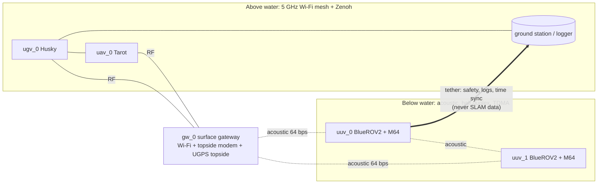

# Reference fleet and communication stack

**Status:** decided 2026-09-28 (PI: platforms and sensors; Claude: communication
stack). Recorded in ADR-0006. The simulator's `harbor_fleet` scenario reproduces
this fleet (`avatar_py/avatar/sim/scenarios.py`).

Spec status: **sheet** = taken from a manufacturer datasheet or product page via
search on 2026-09-28 (open the PDF before quoting it in the paper) ·
**UNVERIFIED** = assumed, must be checked.

## 1. Platforms

| Role | Platform | Required sensors (PI) | Also on board | Sim name |
|---|---|---|---|---|
| UGV (anchor) | Clearpath **Husky A200** | Velodyne **VLP-16** Puck, Intel RealSense **D435i** | wheel odometry, IMU; RTK-GNSS for ground truth | `ugv_0` |
| UAV | **Tarot 680 Pro** hexacopter | RealSense **D435i**, Pixhawk **Cube** (hex) flight controller (PX4), **Jetson Nano** companion computer; Velodyne **VLP-16** added (D6, 2026-10-06) | Cube IMU and barometer; GNSS (Here-class) for ground truth | `uav_0` |
| UUV | Blue Robotics **BlueROV2** | Water Linked **DVL A50**, Tritech **Micron Gemini 720s** | Bar30 depth, IMU/compass, low-light camera, acoustic modem (§3); optional Blue Robotics **Ping360** scanning sonar (PI, 2026-10-07; D14) | `uuv_k` |
| Surface gateway | quay-side mast or buoy (new) | none (relay only) | topside acoustic modem, Wi-Fi mesh radio, GNSS, UGPS topside | `gw_0` |
| USV (optional) | Blue Robotics **BlueBoat** | D435i above, Micron Gemini below | GNSS, acoustic modem | `usv_0` |

*Assumptions:* "BlueHOV2" is read as **BlueROV2**, and "Pixkawk Hex Cube" as the
Hex/ProfiCNC **Cube** (e.g. Cube Orange) running PX4 (the PI confirmed a Pixhawk Hex Cube on
2026-10-06; the exact Cube model is still to be recorded). Both platforms are
"commonly used" choices, as the PI allowed.

### Platform facts used by the simulator

| Item | Value | Status | Source |
|---|---|---|---|
| Husky A200 max speed / payload | 2 m/s, 20–75 kg | sheet | Clearpath spec comparison |
| Tarot 680 Pro payload / endurance | 1.5–2.5 kg, ≈ 15 min | retailer | Tarot 680 Pro product pages |
| BlueROV2 tether | Fathom tether, 25–300 m | sheet | Blue Robotics store |
| BlueBoat payload | up to 15 kg incl. batteries | sheet | Blue Robotics store |

The simulator uses speeds below these maxima: UGV 1.0 m/s, UAV 1.0 m/s, BlueROV2 0.5 m/s.

## 2. Sensors

| Sensor | Key specs | Status | Simulator model (`SENSOR_LIBRARY`) |
|---|---|---|---|
| Velodyne VLP-16 | 16 ch, 100 m, ±3 cm, 360° × 30° (±15°) | sheet | `vlp16`: object-level range 40 m, vertical fan ±15°, σ = 4 cm + 0.2 %·r |
| RealSense D435i | depth FOV 87° × 58°, ideal 0.3–3 m, error grows with range² | sheet | `d435i` / `d435i_down30` (UAV, pitched 30° down): 0.3–6 m, σ = 3 cm + 0.005·r² |
| Tritech Micron Gemini 720s | 720 kHz, 90° horizontal, 50 m, 128 beams, 0.7° angular / 8 mm range resolution, ≤ 20 Hz, built-in pressure sensor | sheet | `gemini_720s`: object-level 0.5–30 m, 90° H; **vertical aperture 20° is UNVERIFIED**; σ_z = 0.1 + 0.1·r (elevation ambiguity) |
| Blue Robotics Ping360 (optional) | mechanical scanning imaging sonar: 750 kHz; 0.75–50 m; beam 2° horizontal × 25° vertical; 0.9° mechanical resolution (1° steps); a full 360° turn takes 3.4–4.3 s at a 1 m range setting and 33 s at 50 m; range resolution 0.08 % of range (4.1 cm at 50 m); 300 m depth rating; 11–25 V, 5 W; 510 g in air, 175 g in water; USB, Ethernet (UDP) or RS-485 (Ping Protocol) | sheet (2026-10-07) | not modelled yet (T-S1-11): a 2-D 360° scan around the BlueROV2, one beam at a time |
| Water Linked DVL A50 | 5 cm–50 m altitude, ≤ 3.75 m/s, ±1.01 % long-term (±0.1 % "Performance" version), 2–15 Hz | sheet | `bluerov2_dvl` odometry: 1 cm/√m random walk + a per-vehicle **1 % scale bias** + heading bias 1.5 mrad/m |
| Cube (PX4) IMU/baro | tri-redundant IMU, barometer | – | `tarot_vio` odometry + `baro` absolute z (σ 0.3 m) |
| BlueROV2 Bar30 | pressure depth | UNVERIFIED σ | `bar30` absolute z (σ 0.02 m) |
| BlueROV2 camera | low-light HD | – | `bluerov2_camera`: 3 m range (turbid harbour) |

**Design implications**

1. **The UAV is a weak mapper.** With only a D435i, useful 3-D detections end at
   about 6 m. The simulated UAV circles the pile rows at a 2.5 m stand-off and
   3 m altitude. Along the centre line between rows it saw 5 objects in 120 s.
   A light LiDAR (a Livox Mid-360 class unit) would make the UAV a first-class
   mapper. This is an optional upgrade (UNVERIFIED specs; decision D6).
   **Simulation evidence (docs/LOG.md L31):** with a VLP-16-class LiDAR next to the
   D435i the Tarot's own SLAM error is 0.10 m in all 30 runs (camera only: one run in
   ten above 1.5 m) and the team's association stays right (G1 30/30). Check payload
   and endurance before buying.
   **Decided (PI, 2026-10-06): a VLP-16 on the Tarot** (D6). It weighs about 0.83 kg
   (sheet, verify), inside the 1.5–2.5 kg payload together with the D435i and the Jetson
   Nano, at a cost in flight time; the Nano's software and compute budget is risk R13
   (T-H1-05). The simulated LiDAR fleet becomes the reference fleet through T-S4-05.
2. **The UGV carries the team frame.** VLP-16 LIO is the most stable estimator
   in the team, so `ugv_0` is the anchor.
3. **Heading is the UUV's weak point.** DVL velocity is good, but heading comes
   from a compass/IMU near steel piles. This is why cross-medium constraints
   matter underwater.
4. **A 360° scanner against sparse fixes (D14).** The BlueROV2 that sees few piles in the
   Gemini's 90° fan is the EKF tracker's remaining failure on sonar images (LOG L41-L43), as the
   camera-only Tarot was before its LiDAR (L31). A Ping360 acts as a slow 2-D LiDAR: one sweep
   covers every pile around the vehicle. Its catch is the sweep time: 3.4-4.3 s per turn at a
   1 m range setting and 33 s at 50 m, so at harbour ranges (10-30 m) one sweep spans many
   seconds of motion at 0.5 m/s. Each beam needs the pose of its own time (from the odometry),
   and the 25° vertical beam leaves elevation as ambiguous as with the Gemini. Simulation first
   (T-S1-11), then the purchase (§6).

## 3. Communication stack (decided by Claude, ADR-0006)

| Layer | Choice | Why |
|---|---|---|
| RF link | 5 GHz Wi-Fi mesh (802.11s or a vendor mesh radio) between UGV, UAV, gateway, ground station | Commodity parts, Mbps rates, fine for inter-agent digests (≤ 1400 B packets) |
| RF middleware | ROS 2 Jazzy with **Zenoh** (`rmw_zenoh_cpp`, binaries exist for Jazzy) for inter-robot traffic; only `/avatar/*` is shared between robots | DDS multicast discovery degrades on multi-robot Wi-Fi; Zenoh routes discovery through routers |
| Acoustic modem (primary) | **Water Linked Modem-M64**: 64 bps, 200 m, 1.5–2.5 s latency, half duplex, UART; one per UUV plus one at the gateway | Same vendor as the DVL A50, native BlueROV2 integration, low cost. 64 bps is the hard regime that makes the paper's scheduling contribution matter |
| Acoustic modem (upgrade) | **Blueprint Subsea SeaTrac X150**: ~100 baud data, 1000 m, USBL tracking of beacons | Adds inter-agent range/bearing (task T-B4-01) and longer range |
| Underwater ground truth | **Water Linked UGPS G2** (SBL, 0.2 % / 1°, 100–300 m) | Used **only** for evaluation, never fed to the estimator (except in an explicit ablation) |
| Tether policy | The BlueROV2 tether carries safety/teleoperation, rosbag logging, and pre-dive time sync. **It never carries Avatar traffic.** This is enforced by publishing `/avatar/*` from the UUV only to the modem bridge (Zenoh ACL / namespace) | Keeps the acoustic-communication claims honest. Without a modem, the ROS 2 comm emulator throttles traffic to the M64 profile, and the paper labels it "emulated acoustic" |
| Relay | Surface gateway: store-and-forward (`avatar.comm.gateway`). Acoustic → RF forwards everything; RF → acoustic sends re-encoded, descriptor-free records of waterline-crossing classes first; `sender_id` = originator | Links differ by ~10⁵× in bit rate |
| Time sync | chrony over Wi-Fi with GNSS-PPS at the gateway. UUVs sync over the tether before diving. Modem stamps carry mission time in ms | The wire format uses `stamp_ms` (spec §2) |
| Wire packets on the M64 | ≤ 64 B (3 landmark records). Fragmentation into modem frames happens in the modem driver (T-C6-01; the M64 frame size is UNVERIFIED) | Losing one packet loses at most three records |

**Capacity check (simulated).** Two BlueROV2s and the gateway share the M64
channel through TDMA, so each node gets 21 bps. At 50 % utilization that is about
1.3 kB per node per 10 minutes, or about 80 landmark records. In 600 s
simulations (5 seeds, docs/LOG.md L6), the whole team shared one frame after
280 s on the M64, a median of 220 s on an X150-class modem, and 120 s at 1 kbps.

## 4. Ground truth for field experiments (plan)

| Agent | Ground truth | Accuracy class |
|---|---|---|
| UGV | RTK-GNSS on the Husky (plus LIO map as a sanity check) | cm |
| UAV | RTK-GNSS (Cube + Here-class receiver) | cm |
| UUV | UGPS G2 SBL + DVL smoothing | dm (0.2 % of range) |
| Structures | Total-station or RTK survey of pile tops and quay; underwater parts from a dive survey or dense sonar map | cm (above) / dm (below) |

## 5. Simulation mapping (Tier 2, Gazebo Harmonic)

| Platform | Gazebo model source | Sensors |
|---|---|---|
| Husky | `clearpath_simulator` (Jazzy + Harmonic packages exist) | gz `gpu_lidar` configured as VLP-16, `rgbd_camera` as D435i |
| Tarot 680 | PX4 SITL hexacopter airframe (a generic hex, tuned to the 680 mm frame) | `rgbd_camera` pitched −30° |
| BlueROV2 | DAVE / BlueROV2 Gazebo models (ROS 2 Jazzy branch) | DAVE multibeam sonar plugin configured to 90° × 20°, 128 beams, 50 m; DAVE DVL plugin; pressure; Ping360: not modelled yet (T-S1-11) |
| Gateway | static model at the quay | none; comm emulator node (T-S3-01) |

## 6. Suggested purchases (not yet approved)

| Item | Qty | Purpose | Priority |
|---|---|---|---|
| Water Linked Modem-M64 | n_UUV + 1 | Real acoustic Avatar traffic | P0 for field results |
| Water Linked UGPS G2 BlueROV2 kit | 1 per UUV | Underwater ground truth | P0 |
| 5 GHz mesh radios | n_RF agents + gateway | Inter-robot RF | P0 |
| RTK-GNSS base + rovers | 1 + 3 | Above-water ground truth | P0 |
| BlueBoat + D435i + Micron Gemini | 1 | Sensing bridge; direct comparison with *Above and Below* | P1 |
| Velodyne VLP-16 for the UAV | 1 | Makes the UAV a useful mapper (LOG L31) | **decided (D6)** |
| Blue Robotics Ping360 | 1 per UUV (the one with sparse fixes first) | 360° 2-D scans against sparse fixes (D14) | P1, after T-S1-11 |

## Sources (checked 2026-09-28)

- [Tritech Micron Gemini 720s product page](https://www.tritech.co.uk/products/microngemini-720s)
- [Water Linked DVL A50 datasheet](https://www.waterlinked.com/datasheets/dvl-a50) · [Blue Robotics DVL A50](https://bluerobotics.com/store/the-reef/dvl-a50/)
- [Water Linked Modem-M64 datasheet (Blue Robotics)](https://bluerobotics.com/wp-content/uploads/2019/02/W-MK-19009-1_Modem-M64_Datasheet.pdf) · [M64 docs](https://docs.waterlinked.com/modem-m64/modem-m64/)
- [Blueprint Subsea SeaTrac](https://www.blueprintsubsea.com/seatrac/seatrac-standard)
- [Water Linked Underwater GPS G2 docs](https://docs.waterlinked.com/underwater-gps/introduction/)
- [RealSense D435i specifications (Intel)](https://www.intel.com/content/www/us/en/products/sku/190004/intel-realsense-depth-camera-d435i/specifications.html)
- [Velodyne VLP-16 specs (Ouster)](https://ouster.com/products/hardware/vlp-16)
- [Clearpath Husky spec comparison](https://clearpathrobotics.com/husky-spec-comparison/) · [clearpath_simulator for Jazzy/Harmonic](https://github.com/Mechazo11/clearpath_simulator_harmonic)
- [Tarot 680 Pro (RobotShop)](https://www.robotshop.com/products/tarot-680-pro-folding-hexacopter-frame)
- [BlueROV2](https://bluerobotics.com/store/rov/bluerov2/) · [BlueBoat](https://bluerobotics.com/store/boat/blueboat/blueboat/)
- [Blue Robotics Ping360 scanning imaging sonar](https://bluerobotics.com/store/sonars/imaging-sonars/ping360-sonar-r1-rp/) (checked 2026-10-07)
- [rmw_zenoh binaries for Jazzy (ROS Discourse)](https://discourse.openrobotics.org/t/rmw-zenoh-binaries-for-rolling-jazzy-and-humble/41395)
