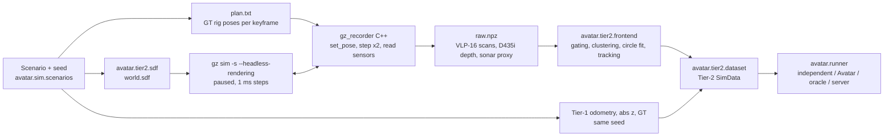

# Tier 2: Gazebo Harmonic recordings

Tier 2 (ADR-0003) renders the Tier-1 scenario in Gazebo Harmonic and replaces
the abstract landmark detections with detections from ray-cast range data.



## What is and is not simulated

| Aspect | Tier 2 v0 |
|---|---|
| World | Tier-1 structures as cylinders/boxes, land (quay wall = its seaward face), flat seabed; one world per seed |
| Vehicles | **Kinematic sensor rigs** moved to the ground-truth pose at every keyframe (1 Hz). No dynamics, no hydrodynamics |
| VLP-16 | `gpu_lidar`, 900 x 16 rays, 360° x 30°, 0.5–100 m; range noise σ = 3 cm added offline |
| D435i | `depth_camera` 212 x 128, 87° x 58°, 0.3–10 m; noise σ = 3 mm + 0.5 %·d² added offline |
| Gemini 720s | **Ray-cast proxy**: `gpu_lidar` 128 beams x 16 elevation rays, 90° x 20°, 0.5–50 m. Elevation is used only to drop seabed and surface returns, then discarded (an imaging sonar does not measure it). No speckle, multipath or acoustic shadows |
| BlueROV2 camera | not emulated (3 m range in turbid water) |
| Odometry, depth, barometer | identical to Tier 1 for the same seed (paired comparison) |
| Semantics | labels/descriptors from the Tier-1 label model of the sensor, attached to detections of a true part (no image detector yet, T-F2-01) |
| Water surface | no visual; optical returns below and acoustic returns above the waterline are removed by the front-end |

DAVE (multibeam sonar, DVL), PX4 SITL and `clearpath_gz` are **not** used:
they could not be installed on the development machine (no root, no Docker
access). Replacing the rigs and the sonar proxy with them is task T-S2-02/03.

## Setup without root (lab machine)

Gazebo Harmonic comes from the ROS 2 Jazzy vendor packages, extracted into a
user directory:

```bash
mkdir -p ~/opt/gzdebs && cd ~/opt/gzdebs
apt-get download $(apt-get -s install ros-jazzy-ros-gz ros-jazzy-gz-sim-vendor \
    | awk '/^Inst/{print $2}')
for f in *.deb; do dpkg -x "$f" ~/opt/gzroot; done
# patch the absolute paths of the gz CLI plugins
J=~/opt/gzroot/opt/ros/jazzy
grep -rl /opt/ros/jazzy $J/opt/*/share/gz/*.yaml $J/opt/*/lib/ruby/gz/*.rb \
    | xargs sed -i "s#/opt/ros/jazzy#$J#g"
```

`~/opt/gz_env.sh` then sets `LD_LIBRARY_PATH`, `GZ_CONFIG_PATH`,
`GZ_SIM_SYSTEM_PLUGIN_PATH`, `GZ_SIM_PHYSICS_ENGINE_PATH`,
`GZ_RENDERING_PLUGIN_PATH`, `GZ_RENDERING_RESOURCE_PATH`,
`OGRE2_RESOURCE_PATH=$J/opt/gz_ogre_next_vendor/lib/OGRE-Next`, and two
variables that were necessary here: `GZ_IP=127.0.0.1` (gz-transport discovery)
and `__EGL_VENDOR_LIBRARY_FILENAMES=/usr/share/glvnd/egl_vendor.d/10_nvidia.json`
(headless GPU rendering). With a normal `sudo apt install ros-jazzy-ros-gz`
only the last two are needed.

## Record and check

```bash
source ~/opt/gz_env.sh
make -C experiments/gazebo GZ_PREFIX=$HOME/opt/gzroot/opt/ros/jazzy   # or default /opt/ros/jazzy
for s in 0 1 2 3 4 5 6 7 8 9; do
  python experiments/gazebo/record.py --seed $s --duration 600 \
      --out results/tier2/harbor_fleet_seed$s
done
python experiments/gazebo/check_geometry.py results/tier2/harbor_fleet_seed0
python experiments/tier2_study.py --runs results/tier2 --out results/tier2_study.csv
```

A 600 s, 601-keyframe recording of the reference fleet takes about 20 s on an
RTX 3050 laptop GPU. `check_geometry.py` projects every return with the
ground-truth pose and measures its distance to the scene primitives; it caught
a pose/scan off-by-one in the first recorder (docs/LOG.md L28) and must be run
on every new recording.

## Front-end regression test without Gazebo

`testdata/tier2` is the first 61 keyframes of one recording (517 KB) with the
statistics the front-end produced on them (`golden.json`).
`avatar_py/tests/test_tier2_fixture.py` compares them in the normal `pytest` job.
Regenerate with `python tools/gen_tier2_fixture.py results/tier2/harbor_fleet_seed0
--out testdata/tier2` when the front-end, the Tier-1 scenario or the recorder changes
on purpose, and say why in the commit.

## Intra-agent tracking modes and their limits

`FrontEndParams.tracking` selects how detections get landmark ids:

| Mode | Association | Status (10 seeds, docs/LOG.md L28) |
|---|---|---|
| `oracle` | ground-truth part identity, as in Tier 1 | the Tier-2 headline: G1 10/10, 0/95 wrong alignments |
| `nn` | gated nearest neighbour in the **dead-reckoning frame**; ambiguous detections are dropped (`track_on_ambiguity`) | fails: G1 6/10, 21/83 wrong alignments |
| `registration` | keyframe-to-map offset, then the same gating | worse: G1 2/10, 37/77 wrong |
| `ekf` | EKF-SLAM over pose, odometry biases and landmarks with the joint covariance (`avatar.frontend.ekf_tracker`) | development seeds 0-19: G1 19/20, 8/181 wrong; held-out seeds 20-39: G1 **19/20**, 6/183 wrong (LOG L30, L31) |

`nn` and `registration` fail once a BlueROV2's raw drift (peaks of 8-10 m here)
approaches the spacing of similar piles (8 m between the pier rows). `ekf` associates
against the agent's own filtered estimate and pairs a keyframe's ambiguous detections
jointly (LOG L29, L30); its residual failure is the UAV, whose sparse fixes leave a
pose σ of about 2 m, so a new pile 8 m from a mapped one is sometimes taken for it. A
LiDAR on the UAV removes it (`--scenario-arg uav_lidar=true`, LOG L31). Report Tier-2 results with `oracle` tracks as the estimator's result
and `ekf` as the realistic front-end, each labelled as such.

Seeds 0-19 are the development set and 20-39 the held-out set (recorded after every
design decision): `make -C experiments tier2-record tier2 tier2-heldout tables`. The
fleet with a LiDAR on the UAV: `tier2-record-lidar tier2-lidar` (seeds 0-19 and 30-39).

```bash
python experiments/tier2_study.py --runs results/tier2 --out results/tier2_study.csv
#   tiers: T1, T2 (oracle), T2nn, T2reg, T2ekf, and the ablations T2nn-uuv / T2nn-land
python experiments/tier2_ekf_sweep.py uuv_1 0 1 2 3 4 -- landmark_density_per_m2=0.01,0.005,0.003
#   one robot over EKF parameter grids
python experiments/tier2_tracker_diagnostics.py results/tier2/harbor_fleet_seed0 --sweep
#   dead-reckoning drift, tracks per part, wrong-track events, gate sweep
```

## Docker route (T-I1-03, T-S2-05)

Tier-2 recording and the DAVE sonar run in containers, as the host user, with the
repository mounted at `/work` (nothing becomes root-owned). Verified on 2026-09-30 on
`luiz-predator-neo` (Ubuntu 24.04, i9-14900HX, RTX 4070 8 GB, 333 GB free, the user in group
`docker`, `nvidia-container-toolkit` working). The old lab machine (RTX 3050, no Docker
access, 21 GB free) is what "Setup without root" above describes; it remains a fallback for
the proxy sensors only.

```
docker build -f docker/Dockerfile.tier2 -t avatar-tier2 .        # 5.2 GB: ROS 2 Jazzy, Gazebo Harmonic, pinned Python
docker build -f docker/Dockerfile.dave --build-arg CUDA_ARCH=89 -t avatar-dave .   # 18.9 GB: + DAVE multibeam sonar
docker/tier2.sh make -C experiments/gazebo                       # the C++ recorder, built in the container
docker/tier2.sh python experiments/gazebo/record.py --seed 0 --duration 600 \
    --out results/tier2/harbor_fleet_seed0
AVATAR_TIER2_IMAGE=avatar-dave docker/tier2.sh bash experiments/gazebo/sonar_smoke/run.sh
```
`CUDA_ARCH` is the GPU's compute capability (89: RTX 40 series, 86: RTX 30 series).
Requirements on another host: the Docker daemon with the user in group `docker` (or rootless
`podman` with a CDI spec), the NVIDIA container toolkit, and about 40 GB of free disk.
Membership of `docker` is root-equivalent on the host.

Checked (LOG L33, L34):
- A 30 s recording made in `avatar-tier2` on the RTX 4070 equals the one made on the old host
  for all five sensors (100 % of the returns agree, |dr| = 0).
- DAVE's `multibeam_sonar` (commit `d2121a5`, the last Jazzy / Harmonic one; ADR-0008) builds
  for `sm_89` and runs headless; the ranges and bearings of a box and a cylinder in
  `sonar_smoke/world.sdf` agree with the geometry.

Things that are easy to trip on:
- The venv of `avatar-tier2` is first on `PATH`; ament (colcon) needs the system Python, so
  `Dockerfile.dave` removes it for the build. Run `rclpy` scripts with `/usr/bin/python3` and
  the analysis (NumPy, SciPy) with the venv's `python`.
- The sonar image topic (`.../sonar_image`) is a colour-mapped picture; the data is
  `.../sonar_image_raw` (`marine_acoustic_msgs/ProjectedSonarImage`, float32 dB, ranges by
  beams), and its header stamp is 0.
- `blazingSonarImage` seeds the speckle with `time(NULL)`; `Dockerfile.dave` patches it to a
  fixed seed plus a frame counter so that a recording is reproducible (L34).

## Sonar images (DAVE), task T-S2-05

The BlueROV2 rigs can carry DAVE's CUDA multibeam sonar instead of the ray-cast proxy
(ADR-0008, LOG L34). It is recorded in a second pass over an existing recording, in the
`avatar-dave` image:

```
make -C experiments tier2-record-sonar    # <run>/sonar.npz per development seed (77 MB, 138 s)
make -C experiments tier2-sonar sonar-diagnostics   # tiers T2s, T2snn, T2sekf; the controls
```
- **Acoustic world** (`avatar.tier2.sdf.sonar_world_sdf`): only what is below the waterline
  (structures clipped at z = 0, the quay face, the seabed), because DAVE has no water surface.
- **One frame per sonar per keyframe**: `record_sonar.py` writes a plan; `sonar_driver.py`
  (system Python of the image: rclpy and gz.transport13, NumPy 1.x, so it only does I/O) sets the
  rig poses, steps two 1 ms iterations and waits for the frames. Frames are matched by order (the
  header stamps are not simulation time). The world is first stepped to a fixed simulation time,
  and the speckle seed of DAVE is patched to `time + sensor name` (`docker/patch_dave_seed.py`),
  so a recording is reproducible.
- **Images**: `<agent>/<sensor>` (keyframes, 940 range rows of 3.2 cm, 129 beams) as uint8 dB
  in [-20, 100], with `.../range_m` and `.../azimuth_rad`. `sonar_smoke/` is the first check.
- **DAVE quirks that cost time**: the vertical ray angles of the SDF are illuminated at twice
  their value (the SDF holds a quarter of the FOV on each side); parallel recordings need one ROS
  domain each (set by `record_sonar.py`), because containers on one docker network hear each
  other's topics; run `rclpy` scripts with `/usr/bin/python3`, the analysis with the venv.
- Detector: `avatar.tier2.sonar_image` (tests in `test_sonar_image.py`), tiers with a `+sonar`
  suffix in `tier2_study.py`. **Result on the development seeds: 2/20 teams merge (LOG L34).**
