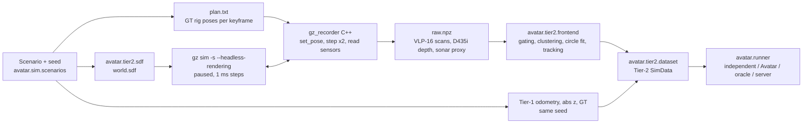

# Tier 2: Gazebo Harmonic recordings

Tier 2 (ADR-0003) renders the Tier-1 scenario in Gazebo Harmonic and replaces
the abstract landmark detections with detections from ray-cast range data.



## What is and is not simulated

| Aspect | Tier 2 v0 |
|---|---|
| World | Tier-1 structures as cylinders/boxes, land (quay wall = its seaward face), flat seabed; one world per seed |
| Vehicles | **Kinematic sensor rigs** moved to the ground-truth pose at every keyframe (1 Hz). No dynamics, no hydrodynamics |
| VLP-16 | `gpu_lidar`, 900 x 16 rays, 360° x 30°, 0.5–100 m; range noise σ = 3 cm added offline |
| D435i | `depth_camera` 212 x 128, 87° x 58°, 0.3–10 m; noise σ = 3 mm + 0.5 %·d² added offline |
| Gemini 720s | **Ray-cast proxy**: `gpu_lidar` 128 beams x 16 elevation rays, 90° x 20°, 0.5–50 m. Elevation is used only to drop seabed and surface returns, then discarded (an imaging sonar does not measure it). No speckle, multipath or acoustic shadows |
| BlueROV2 camera | not emulated (3 m range in turbid water) |
| Odometry, depth, barometer | identical to Tier 1 for the same seed (paired comparison) |
| Semantics | labels/descriptors from the Tier-1 label model of the sensor, attached to detections of a true part (no image detector yet, T-F2-01) |
| Water surface | no visual; optical returns below and acoustic returns above the waterline are removed by the front-end |

DAVE (multibeam sonar, DVL), PX4 SITL and `clearpath_gz` are **not** used:
they could not be installed on the development machine (no root, no Docker
access). Replacing the rigs and the sonar proxy with them is task T-S2-02/03.

## Setup without root (lab machine)

Gazebo Harmonic comes from the ROS 2 Jazzy vendor packages, extracted into a
user directory:

```bash
mkdir -p ~/opt/gzdebs && cd ~/opt/gzdebs
apt-get download $(apt-get -s install ros-jazzy-ros-gz ros-jazzy-gz-sim-vendor \
    | awk '/^Inst/{print $2}')
for f in *.deb; do dpkg -x "$f" ~/opt/gzroot; done
# patch the absolute paths of the gz CLI plugins
J=~/opt/gzroot/opt/ros/jazzy
grep -rl /opt/ros/jazzy $J/opt/*/share/gz/*.yaml $J/opt/*/lib/ruby/gz/*.rb \
    | xargs sed -i "s#/opt/ros/jazzy#$J#g"
```

`~/opt/gz_env.sh` then sets `LD_LIBRARY_PATH`, `GZ_CONFIG_PATH`,
`GZ_SIM_SYSTEM_PLUGIN_PATH`, `GZ_SIM_PHYSICS_ENGINE_PATH`,
`GZ_RENDERING_PLUGIN_PATH`, `GZ_RENDERING_RESOURCE_PATH`,
`OGRE2_RESOURCE_PATH=$J/opt/gz_ogre_next_vendor/lib/OGRE-Next`, and two
variables that were necessary here: `GZ_IP=127.0.0.1` (gz-transport discovery)
and `__EGL_VENDOR_LIBRARY_FILENAMES=/usr/share/glvnd/egl_vendor.d/10_nvidia.json`
(headless GPU rendering). With a normal `sudo apt install ros-jazzy-ros-gz`
only the last two are needed.

## Record and check

```bash
source ~/opt/gz_env.sh
make -C experiments/gazebo GZ_PREFIX=$HOME/opt/gzroot/opt/ros/jazzy   # or default /opt/ros/jazzy
for s in 0 1 2 3 4 5 6 7 8 9; do
  python experiments/gazebo/record.py --seed $s --duration 600 \
      --out results/tier2/harbor_fleet_seed$s
done
python experiments/gazebo/check_geometry.py results/tier2/harbor_fleet_seed0
python experiments/tier2_study.py --runs results/tier2 --out results/tier2_study.csv
```

A 600 s, 601-keyframe recording of the reference fleet takes about 20 s on an
RTX 3050 laptop GPU. `check_geometry.py` projects every return with the
ground-truth pose and measures its distance to the scene primitives; it caught
a pose/scan off-by-one in the first recorder (docs/LOG.md L28) and must be run
on every new recording.

## Intra-agent tracking modes and their limits

`FrontEndParams.tracking` selects how detections get landmark ids:

| Mode | Association | Status (10 seeds, docs/LOG.md L28) |
|---|---|---|
| `oracle` | ground-truth part identity, as in Tier 1 | the Tier-2 headline: G1 10/10, 0/95 wrong alignments |
| `nn` | gated nearest neighbour in the **dead-reckoning frame**; ambiguous detections are dropped (`track_on_ambiguity`) | fails: G1 6/10, 21/83 wrong alignments |
| `registration` | keyframe-to-map offset, then the same gating | worse: G1 2/10, 37/77 wrong |

`nn` and `registration` fail once a BlueROV2's raw drift (peaks of 8-10 m here)
approaches the spacing of similar piles (8 m between the pier rows). Association
against the agent's own SLAM estimate is task T-F3-02. Report Tier-2 results with
`oracle` tracks, labelled as such.

```bash
python experiments/tier2_study.py --runs results/tier2 --out results/tier2_study.csv
#   tiers: T1, T2 (oracle), T2nn, T2reg, and the ablations T2nn-uuv / T2nn-land
python experiments/tier2_tracker_diagnostics.py results/tier2/harbor_fleet_seed0 --sweep
#   dead-reckoning drift, tracks per part, wrong-track events, gate sweep
```
